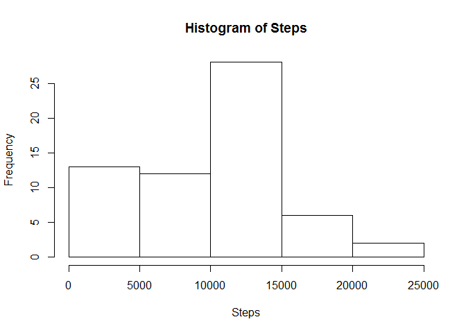
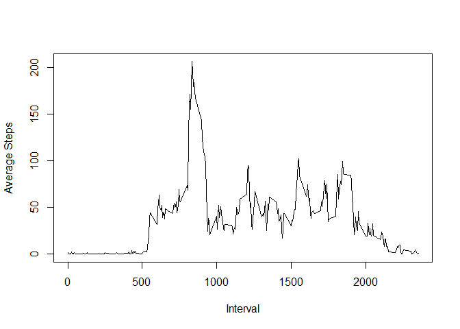
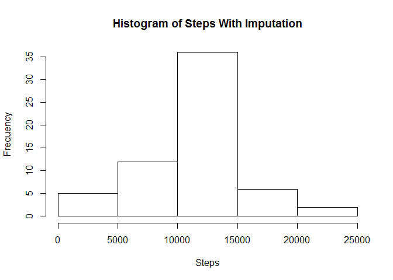
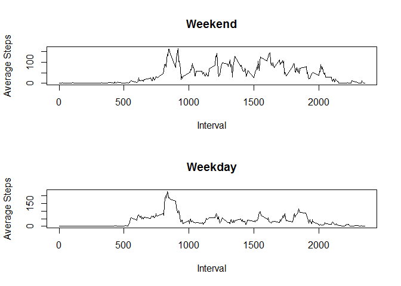

# Reproducible Research: Peer Assessment 1


## Loading and preprocessing the data
Here we load the data and create a new variable, date2, which contains the date in the correct date class.

```r
all_data <- read.table("activity.csv", header = TRUE, sep = ",")
all_data$date2 <- as.Date(all_data$date)
```


## What is mean total number of steps taken per day?
First we create a matrix which contains the number of steps per day (removing NA values). Then we create the histogram which shows the distribution of steps per day.

```r
steps_per_day <- rowsum(all_data$steps, all_data$date, na.rm=TRUE)
hist(steps_per_day[,1], main="Histogram of Steps", xlab="Steps")
```

 

Now we calculate the mean and median of the number of steps taken in a day (removing NA values).

```r
mean(steps_per_day, na.rm=TRUE)
```

```
## [1] 9354.23
```

```r
median(steps_per_day, na.rm=TRUE)
```

```
## [1] 10395
```

## What is the average daily activity pattern?
First we create a vector which contains the average number of steps for each five-minute interval. The dimnames of this vector are what we need for the x-axis, so we put them into a separate vector.

```r
steps_by_interval <- tapply(all_data$steps, all_data$interval, FUN = mean, na.rm=T)
intervals <- as.numeric(unlist(dimnames(steps_by_interval)))
```

Now we create a time series plot of the number of steps for each five-minute interval.

```r
plot(intervals, steps_by_interval, type="l", xlab = "Interval", ylab = "Average Steps")
```

 

Now we need to determine which interval had the highest average number of steps.


```r
intervals[steps_by_interval == max(steps_by_interval)]
```

```
## [1] 835
```


## Imputing missing values
Here we first calculate the total number of rows which have NAs.

```r
sum(!complete.cases(all_data))
```

```
## [1] 2304
```

Now, in place of all missing values, we impute the average for that particular 5 minute interval over the other days.


```r
#copy the data
imputed <- all_data

#this loops through every row. When it finds an NA, it replaces the NA with the average steps from the steps_by_interval vector created above (each element we access using its dimname, which is possible since it was created with tapply).
for(i in 1:nrow(imputed)) {
    if (is.na(imputed[i, "steps"])) {
        current_interval <- as.character(imputed[i, "interval"])
        imputed[i, "steps"] <- steps_by_interval[current_interval]
    }
}
```


Now we calculate a histogram as above.

```r
imp_steps_per_day <- rowsum(imputed$steps, imputed$date, na.rm=FALSE)
hist(imp_steps_per_day, main="Histogram of Steps With Imputation", xlab="Steps")
```

 

Now we calculate the mean and median of the number of steps taken as above.

```r
mean(imp_steps_per_day, na.rm=F)
```

```
## [1] 10766.19
```

```r
median(imp_steps_per_day, na.rm=F)
```

```
## [1] 10766.19
```
The histogram has much less mass around the lower end than in the case above. This makes sense given that without imputation, intervals with NA values were effectively counted as 0 (since nothing was added to that day's total number of steps).  

The mean and median are both higher for the same reason; now we have values being added to the totals for each day that were not being added before.  

Note:I believe that the equivalence of the newly calculated mean and median is somehow a consequence of the imputation method that I chose.


## Are there differences in activity patterns between weekdays and weekends?

Now we create a factor variable called daytype on the imputed dataset which indicates whether the date is a weekday or weekend.


```r
imputed$daytype <- ifelse(weekdays(imputed$date2) == "Saturday" | weekdays(imputed$date2) == "Sunday", "weekend", "weekday")
imputed$daytype <- as.factor(imputed$daytype) #convert to factor
```

Now we make the final plot: a panel plot of two plots which are time series in the manner of the plots above (but separated by weekday and weekend).


```r
par(mfrow = c(2, 1))

#first plot
weekendsubset <- subset(imputed, daytype=="weekend")
weekend_steps_by_interval <- tapply(weekendsubset$steps, weekendsubset$interval, FUN = mean, na.rm=T)
plot(intervals, weekend_steps_by_interval, type="l", xlab = "Interval", ylab = "Average Steps", main = "Weekend")

#second plot
weekdaysubset <- subset(imputed, daytype=="weekday")
weekday_steps_by_interval <- tapply(weekdaysubset$steps, weekdaysubset$interval, FUN = mean, na.rm=T)
plot(intervals, weekday_steps_by_interval, type="l", xlab = "Interval", ylab = "Average Steps", main = "Weekday")
```

 


